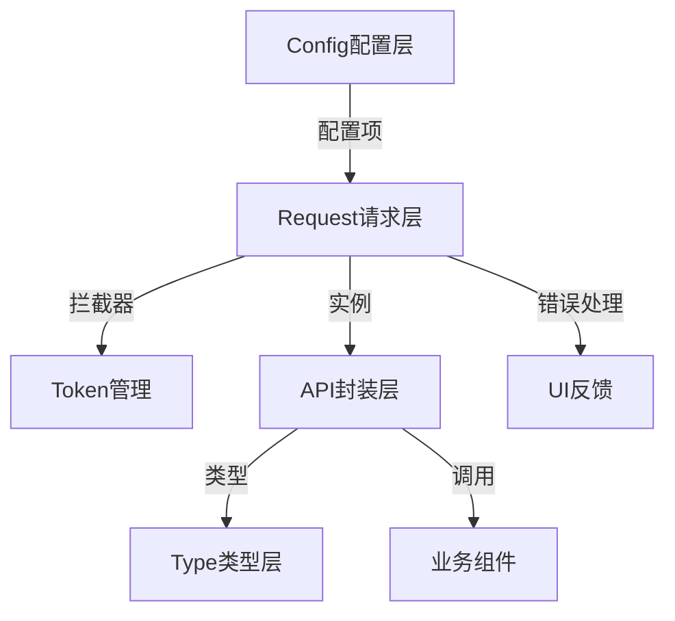

## 产品概述

对现有网络请求模块进行系统性重构，提升代码质量和可维护性，修复Token管理问题。

## 核心功能

- 统一的请求响应拦截机制
- 完善的Token自动刷新与管理
- 类型安全的API接口定义
- 统一的错误处理与用户反馈
- 灵活的配置管理
- 可复用的请求工具函数

## 技术栈

- 基于现有项目技术栈（TypeScript + Axios）

## 技术架构

### 系统架构

- 架构模式：分层架构（配置层、请求层、API层、类型层）
- 组件关系：Config配置 → Request实例 → API封装 → 业务调用



### 模块划分

- **类型层（types）**：统一的请求响应类型定义、API接口类型
- **配置层（config）**：环境配置、请求基础配置
- **请求层（request）**：Axios实例封装、拦截器、Token管理
- **API层（api）**：业务API接口封装
- **工具层（utils）**：请求相关的工具函数（错误处理、响应处理等）

### 数据流

业务调用 → API封装 → Request实例 → 拦截器（Token/错误）→ Axios → 服务器响应 → 拦截器处理 → 返回结果

## 实现细节

### 核心目录结构

针对现有项目的重构，显示修改/新增的文件结构：

```
src/
├── services/
│   ├── request/
│   │   ├── index.ts           # 重构：核心请求实例与拦截器
│   │   ├── types.ts           # 新增：请求响应核心类型
│   │   ├── interceptors.ts    # 新增：请求/响应拦截器
│   │   └── tokenManager.ts    # 新增：Token管理模块
│   ├── config/
│   │   └── index.ts           # 重构：统一配置管理
│   ├── api/
│   │   └── blog.ts            # 重构：基于新框架的API封装
│   └── utils/
│       └── errorHandler.ts   # 新增：统一错误处理
```

### 关键代码结构

**请求响应类型定义**：定义通用的请求和响应数据结构，确保类型安全。

```typescript
// 核心请求响应类型
interface BaseResponse<T = any> {
  code: number;
  data: T;
  message: string;
  timestamp: number;
}

interface RequestConfig extends AxiosRequestConfig {
  showLoading?: boolean;
  showError?: boolean;
  skipAuth?: boolean;
}
```

**Token管理器**：管理Token的存储、刷新、过期检查。

```typescript
class TokenManager {
  getToken(): string | null;
  setToken(token: string): void;
  removeToken(): void;
  isExpired(): boolean;
  async refreshToken(): Promise<string>;
}
```

**请求拦截器**：处理Token注入、请求配置。

```typescript
function setupRequestInterceptors(instance: AxiosInstance) {
  instance.interceptors.request.use(
    (config) => {
      // Token注入逻辑
      // 统一配置处理
      return config;
    },
    (error) => Promise.reject(error)
  );
}
```

### 技术实施方案

**1. 类型安全增强**

- 定义完整的请求响应类型
- 为API接口提供泛型支持
- 使用TypeScript严格模式

**2. Token管理重构**

- 封装TokenManager类
- 实现自动刷新机制
- 处理并发刷新请求

**3. 错误处理统一**

- 集中错误处理逻辑
- 区分网络错误、业务错误、Token错误
- 提供用户友好的错误提示

**4. 代码复用优化**

- 提取公共拦截器逻辑
- 统一配置管理
- 创建请求工具函数

### 集成点

- 与现有组件无缝集成，保持API兼容性
- 状态管理（如有）集成Token状态
- UI组件集成统一错误提示

## 技术考虑

### 性能优化

- 请求缓存机制（可选）
- 取消重复请求
- Token刷新去重

### 安全措施

- HTTPS强制
- Token存储安全
- 敏感信息不打印到日志

### 可扩展性

- 支持多实例配置
- 插件化拦截器
- 灵活的配置覆盖

## Agent扩展

### SubAgent

- **code-explorer**
- 目的：探索和分析现有services目录下的所有相关文件，理解当前的代码结构和依赖关系
- 预期结果：完整的代码结构分析和依赖关系图，为重构提供基础